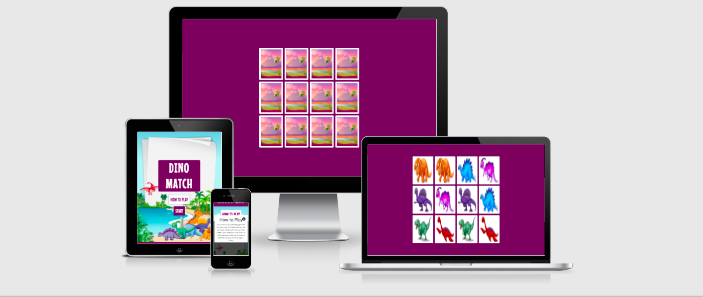

 [View Live Site Here](https://nikimacm.github.io/dino-hatch/)


# Dino Match

## Contents

[Overview](#overview)
* [UX](#ux)
    * [Project Goals](#project-goals)
    * [User Goals](#user-goals)
    * [User Stories](#user-stories)
    * [Site Owner Goals](#site-owner-goals)
    * [User requirements and expectations](#User-requirements-and-expectations)

* [DESIGN](#design)
    * [Design Choices](#design-choices)
    * [Colors](#colors)
    * [Fonts](#fonts)
    * [Structure](#structure)

* [WIREFRAMES](#wireframes)
    * [Start Page](#start)
    * [Game Page](#game)
    * [Congratulations Modal](#congratulations)


* [TECHNOLOGIES USED](#technologies)

    * [Github](#github)
    * [Gitpod](#gitpod)
    * [Google Fonts](#google-fonts)
    * [Font Awesome](#font-awesome)
    * [Bootstrap CDN](#bootstrap)
    * [jQuery](#jquery)
    * [Popper.js](#popper.js)
    * [WAVE](#wave)
    * [W3 HTML](#w3-html)
    * [Jigsaw CSS](#jigsaw-css)
    * [Balsamic](#balsamic)
    * [HTML Beautifier](#html-beautyfier)

* [TESTING](#testing)

* [BUGS](#bugs)

* [DEPLOYMENT](#deployment)

* [CREDITS](#credits)

### Overview <hr>

 
### UX <hr>
#### Project Goals 

The goal of this project is to develop a simple memory match game for little kids using HTML, CSS and JavaScript. It was inspired by my three year old daughter who is obsessed with dinosaurs. The project needs to be fun, functional and simple to play.

#### User Goals

1. To be able to navigate the site easily.

2. To have fun finding the cute dinosaurs.

#### User Stories

3. As a young child I would like to have fun matching the cute dinosars which are easily recognisable.

4. As a parent I want a game that is simple for my child to play and understand while fun at the same time.

#### Site Owner Goals

5. Develop a fun and simple game which is appealing to small children.

6. Add more difficult levels which will teach children to say the dinosaur names. 

7. Continue to develop the game to include dinosaur facts and a quiz so parents and children can engage in the game together.

#### User Requirements and expectations

8. A fast loading time.

9. A website which is clear and easy to navigate.

10. Recognisable format, no surprises.

11. A well designed, aesthetically pleasing user interface..


### DESIGN <hr>

#### DESIGN CHOICES

I chose to use a colourful, cute design using images which are appealing to young children and toddlers. 

#### COLOURS

The colours I have used are bright and engaging.

#### FONTS

I have used two fonts througout this project. There is not a lot of text, only the heading, buttons and how tp play modal. I used Mouse Memoirs for the heading and Roboto for the text. Mouse memoirs is a very playful and fun font and Roboto goes very well with it.

#### IMAGES

I choose to use cute and colourful dinosaur images to appeal to young children. While children in the 3-5 age range love dinosaurs they can also be afraid of scary dinosaur images. I dowmloaded all my images from vectorstock https://www.vectorstock.com/free-vectors and vecteezy https://www.vecteezy.com/.

### WIREFRAMES <hr>


#### Mobile

* [mobile-wireframes](images/mobile-wireframes.png)


#### Tablet

* [tablet-wireframes](images/tablet-wireframes.png)

#### Desktop

* [desktop-wireframes](images/desktop-wireframes.png)


### TECHNOLOGIES USED <hr>

Languages used:

* Javascript
* HTML 5
* CSS
- [Gitpod](https://gitpod.io) 
    - Used **Gitpod** as my open source platform.
- [Github](https://github.com/) 
    - Used **Github** as my code hosting platform
- [Google Fonts](https://fonts.google.com/)
    - This project uses **Google fonts** to style the website fonts.
- [BootstrapCDN](https://www.bootstrapcdn.com/)
    - This project uses **Bootstrap4** to simplify the structure of the website and make the website responsive
    - This project also uses BootstrapCDN to provide icons from [FontAwesome](https://www.bootstrapcdn.com/fontawesome/)

- [jQuery](https://jquery.com/)
    - This project uses **jQuery** to reference Javascript needed for the responsive navbar.
- [Popper.js](https://popper.js.org/)
    - **Popper.js** was used to reference Javascript needed for the responsive navbar.
- [WAVE](https://wave.webaim.org)
    - Used **WAVE** to evaluate my code to ensure the content is fully accessable to individuals with disabilities.
- [W3 HTML](https://validator.w3.org/)
    - Used **W3 HTMLs** for HTML code valuation
- [Jigsaw CSS](https://jigsaw.w3.org/css-validator/)
    - Used **Jigsaw CSS** to Validate CSS Code
- [Balsamic](https://balsamiq.com/)
    - Used **Balsamic** to create [WIREFRAMES](#wireframes)
- [Minify Code](http://minifycode.com/html-beautifier/)
    - **Minify Code** is a tool I used to minify and beautify CSS and HTML codes


### TESTING <hr>

### Performance

Google Lighthouse was used to measure the speed and performance of the website. 

#### Start

* [Lighthouse Mobile Start](docs/lighthouse-mobile-start.png)
* [Lighthouse Desktop Start](docs/lighthouse-desktop-start.png)

#### Game

* [Lighthouse Mobile Game](docs/lighthouse-mobile-start.png)
* [Lighthouse Desktop Game](docs/lighthouse-desktop-start.png)


### Accessibility

WAVE Web Accessibility Evaluation Tool was used to test the sites accessibility....

#### Start

* No errors were detected.


#### Game

* No errors were detected


### HTML and CSS Validation


* HTML Validation

Document checking completed. No errors or warnings to show.


* CSS Validation 


### DEPLOYMENT <hr>

This project was developed using the [Gitpod](https://gitpod.io), committed to git, and pushed to GitHub using the Gitpod terminal. 

To deploy this page to GitHub Pages from its [GitHub repository](https://nikimacm.github.io/dino-hatch/), the following process was completed: 
1. Log into GitHub. 
2. Click on the account avatar in the top right corner and select "Your repositories" from the dropdown menu.
3. From the list of repositories, select **gbrw**.
4. From the menu bar at the top of the page, select **Settings**.
5. In the menu bar on the left side of the screen, select the second menu item from the bottom, "Pages."
6. In the **Source** section, select **Master Branch** from the dropdown menu, then click on **Save**.
7. As a result, the page is refreshed and the website deployed. The **website URL** appears in a blue box above the **Source Section**.

At the moment of submitting this Milestone project the Development Branch and Master Branch are identical. 

### How to run this project locally
To clone this project into Gitpod you will need a Github account. [Create a Github account here](https://github.com/)

Then follow these steps:
1. Log into [Gitpod](https://gitpod.com) with your gitpod account.
2. Navigate to the [Project GitHub repository](https://nikimacm.github.io/dino-hatch/)
3. Click the green "Gitpod" button in the top right corner of the respository
4. This will trigger a new gitpod workspace to be created based on the code in GitHub. There, you will be able to work locally.

To work on the project code within a local IDE such as VSCode, Sublime Text, etc.:
1. Navigate to the [Project GitHub repository](https://nikimacm.github.io/dino-hatch/)
2. Click the "Code" download button next to the green "Gitpod" button.
3. In the Clone section, select HTTPs and copy the clone URL for the repository. 
4. Open your local terminal.
5. Change the current working directory to the location where you want the cloned directory to be located.
6. Type ```git clone```, and then paste the URL you copied in Step 4.
7. Press Enter for your local clon to be created.


### CREDITS<hr>

// Credit to freeCodeCamp.org/ https://marina-ferreira.github.io/memory-game/  
This you tube video helped me to implement the memory cards flip, match and structure.

#### Images

I downloaded all the images for this site from vectorstock https://www.vectorstock.com/free-vectors and vecteezy https://www.vecteezy.com/.


 
 ### ACKNOWLEDGEMENTS<hr><hr>

 I have been very short on time for this project due to unforseen circumstances, and would like to thank Alexander in student care for all his support and help when I really needed it. 
